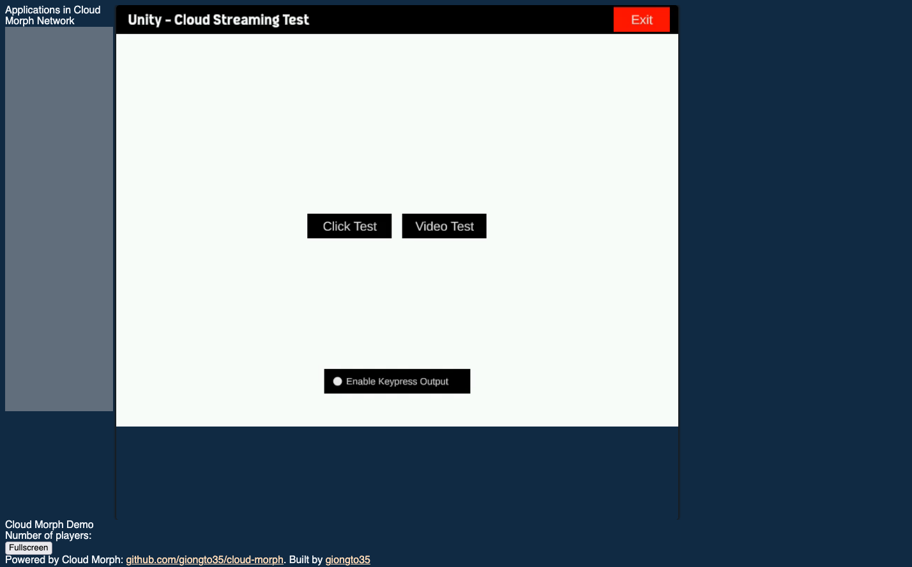

# Cloud Game Streaming Server

A cloud-based game streaming solution that spawns dedicated Unity game instances for each user session, streaming gameplay via WebRTC and handling inputs through WebSocket.

## Features
- **Session Management**: Unique sessions with isolated game instances
- **Cloud Streaming**: WebRTC video/audio streaming to browsers
- **Multi-Instance Support**: Concurrent gameplay sessions
- **Auto-Scaling**: Dynamic port allocation and instance management
- **Session Cleanup**: Automatic termination of inactive sessions

## Running Locally

### Prerequisites
- Go 1.16+
- Docker
- Unity game build (provided separately)

### Quick Start
```bash
# Clone repository
git https://github.com/sanakspock/cloudgame.git
cd cloudgame
# Install dependencies (if setup.sh exists)
chmod +x setup.sh
./setup.sh

# Start server
go run server.go
```


## Architecture Overview
```
+-------------+       +----------------+       +---------------+
|   Client    | <---> |  WebSocket     | <---> | Game Instance |
| (Browser)   | WebRTC| Server (Go)    |       | (Unity/Windows)|
+-------------+       +----------------+       +---------------+
                        | Session Manager
                        | Port Allocator
                        | Cloud Morph Integration
```

## Key Implementation Details

### Session Management
1. **Session Creation**
   - UUID generated on first visit
   - Cookie-based session tracking
   - Session storage with mutex-protected map
   ```go
   type SessionData struct {
       SessionID    string
       GameInstance *cloudapp.Server
       Port         int
       LastActive   time.Time
   }
   ```

2. **Session Cleanup**
   - Janitor goroutine removes inactive sessions (15min timeout)
   - Port recycling system
   ```go
   func (s *Server) sessionJanitor() {
       for range time.Tick(1 * time.Minute) {
           // Cleanup logic
       }
   }
   ```

### Game Instance Management
1. **Port Allocation**
   - Pool of 100 available ports (5000-5099)
   - Dynamic TCP port allocation when pool exhausted
   ```go
   func (s *Server) getAvailablePort() int {
       select {
       case port := <-s.portPool: return port
       default: return findRandomPort()
       }
   }
   ```

2. **Instance Spawning**
   - Unity instances via Cloud Morph library
   - Headless Windows execution through Wine
   ```go
   func (s *Server) spawnGameInstance(port int) *cloudapp.Server {
       cfg := config.Config{InstanceAddr: fmt.Sprintf(":%d", port)}
       return cloudapp.NewServer(cfg)
   }
   ```

### Cloud Streaming
1. **WebRTC Integration**
   - Cloud Morph handles video/audio encoding
   - Browser-side WebRTC negotiation
   ```go
   // Cloud Morph internal handling
   gameServer := cloudapp.NewServerWithHTTPServerMux(...)
   ```

2. **Input Handling**
   - WebSocket message types:
     ```go
     var appEventTypes = []string{
         "MOUSEDOWN", "MOUSEUP", 
         "MOUSEMOVE", "KEYDOWN", "KEYUP"
     }
     ```
   - Input routing to game instances

## end results 


## License
MIT License - See [LICENSE](LICENSE) for details